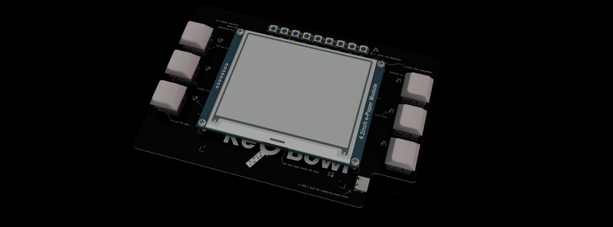
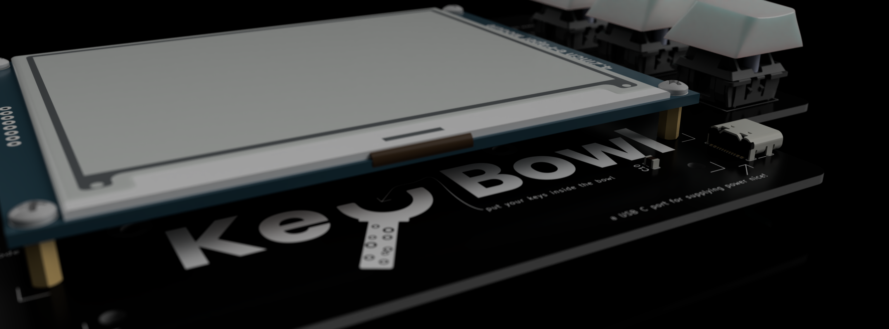
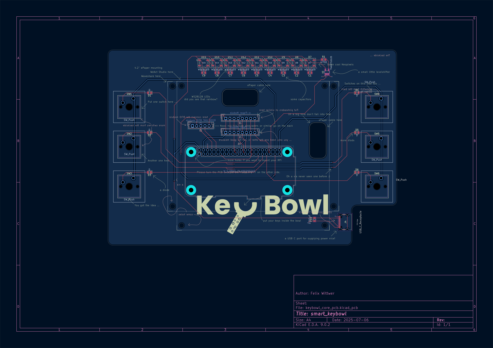
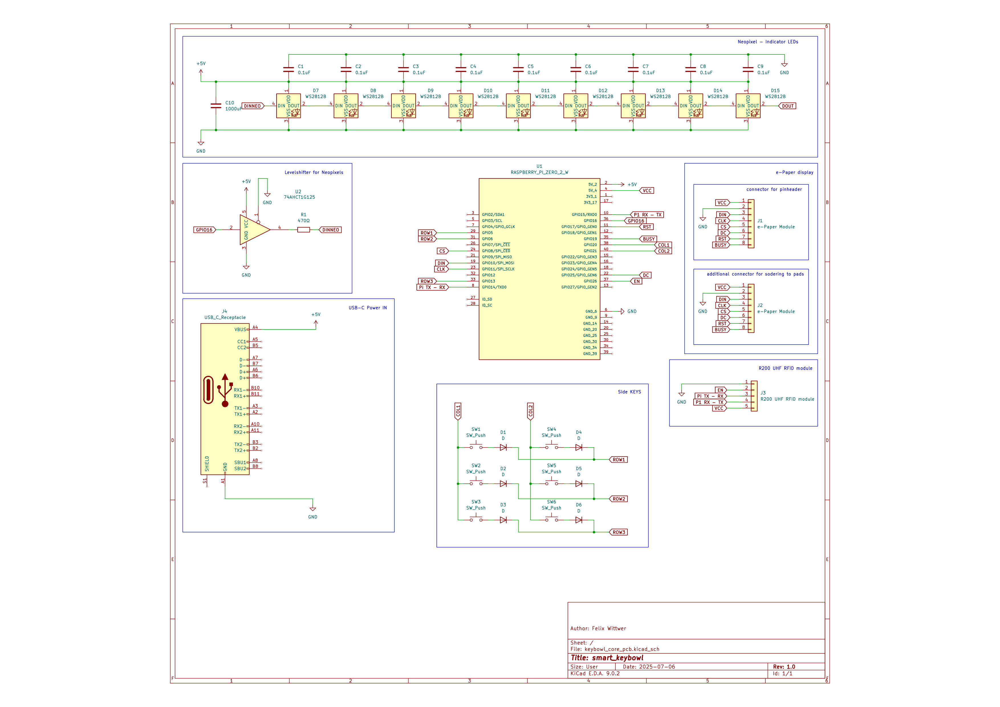
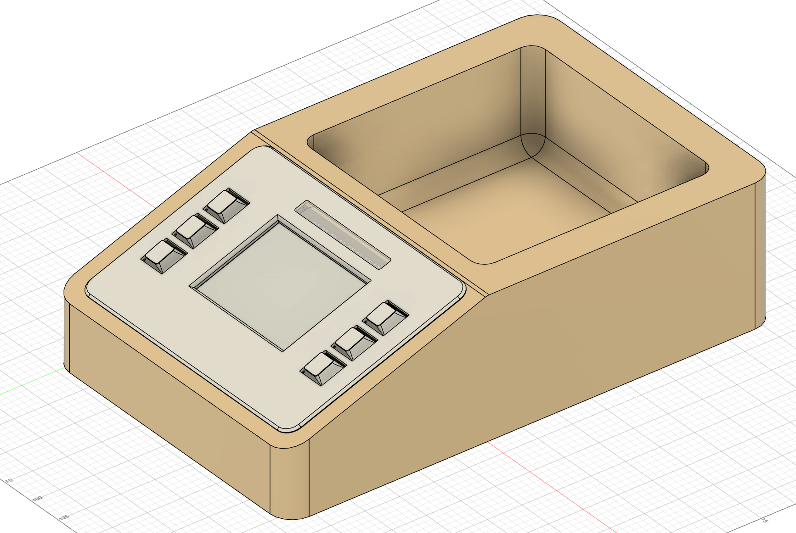

 

 &nbsp; &nbsp; 

 

# homeassistant_keybowl
a smart bowl for your keys with Homeassistant integration and a display to show simple dashoards.

## About the project

This project is smart keybowl where you can toss all your keys into and it will show you some interesting stuff from your Homeassistant instance. It simply hits you with the information you need when leaving home or comming back. The shown dashboards are custom for each user and are recognised by the RFID tag on each keychain.

The Keybowl should speed up your everyday routine by presenting you all the information you might have to look up in some app on your phone. For me personally my dashboard will contain a short version of the days timetable for school and its current changes for the day. When comming home it will probably display some stats of my servers.

The Keybowl siply will be a smart everday helper to make my and the life of others a bit easier and reduce the time you have to look up some information on your phone.

## PCB

  
  

## whole Project

A screenshot of the whole project. Sorry no beautiful render fusions standard wood textures look just ugly :(.

## BOM

### Aliexpress

**total:** 141.60 USD

| part name | amount | price | link | note |
| --------- | ------ | ----- | ---- | ---- |
| UHF RFID Module 1dbi 35x35mm | 1 | 39.27 USD | https://de.aliexpress.com/item/1005008307223636.html?spm=a2g0o.productlist.main.2.3a2056acCbDovs&algo_pvid=561ac428-5895-4565-92d7-d20539900a0c&pdp_ext_f=%7B%22order%22%3A%228%22%2C%22eval%22%3A%221%22%7D&utparam-url=scene%3Asearch%7Cquery_from%3A | |
| 4.2inch e-paper | 1 | 29.38 USD | https://de.aliexpress.com/item/1005005825856739.html?spm=a2g0o.productlist.main.11.398af4a457pUEA&algo_pvid=a1b8dab7-90ac-46bd-aca0-fde6fcd30138&pdp_ext_f=%7B%22order%22%3A%2213%22%2C%22eval%22%3A%221%22%7D&utparam-url=scene%3Asearch%7Cquery_from%3A | would have liked to choose another one but waveshare has the best documentation and if you decide to upgrade the displays have the same footprint (upgrading from 4 grayscale to black/white/red possible)|
| Raspberry Pi Zero 2 W | 1 | 20.57 USD | https://de.aliexpress.com/item/1005008147614202.html?spm=a2g0o.productlist.main.9.1e3f432ciKsp9W&algo_pvid=32a8750d-1fe9-43b5-99b0-1ed1efdb7aec&pdp_ext_f=%7B%22order%22%3A%22141%22%2C%22eval%22%3A%221%22%7D&utparam-url=scene%3Asearch%7Cquery_from%3A | Pi Zero needed because of Homeassistant integration and connectivity (ESP32-S3 can't quite manage all this stuff together) |
| RFID tags | 5pcs | 0.99 USD | https://de.aliexpress.com/item/1005008292479936.html?spm=a2g0o.productlist.main.45.186a419cIs6EWx&algo_pvid=f2a1d2c4-8d39-4e0e-816f-0145ab5a5fc3&pdp_ext_f=%7B%22order%22%3A%2224%22%2C%22eval%22%3A%221%22%7D&utparam-url=scene%3Asearch%7Cquery_from%3A
| keyswitches | 6 | 1.19 USD | https://de.aliexpress.com/item/1005005371211477.html?spm=a2g0o.productlist.main.6.79e64294kL6s5H&algo_pvid=e22f25ac-00f0-4e9f-a177-d081d068b5ac&pdp_ext_f=%7B%22order%22%3A%2213%22%2C%22eval%22%3A%221%22%7D&utparam-url=scene%3Asearch%7Cquery_from%3A | come as 10 pcs set |
| basic DSA Keycaps | 6 | 1.19 USD | https://de.aliexpress.com/item/1005006005905021.html?spm=a2g0o.productlist.main.11.3fe97aeaDABDMY&algo_pvid=8be567c0-1498-4e45-9ebd-240fe64a8e61&pdp_ext_f=%7B%22order%22%3A%22525%22%2C%22eval%22%3A%221%22%7D&utparam-url=scene%3Asearch%7Cquery_from%3A | come as 20 pcs set |
| PCB and PCBA | 1 | ~ 50 USD |  https://jlcpcb.com/ | price is subject to JLCs review |

**total:** 141.60 USD

 
 
fro people who don't want to order via aliexpress or simply can't here is a BOM with mostly amazon equivalients

### Amazon (mostly)

**total:** 192.48 USD

| part name | amount | price | link | note |
| --------- | ------ | ----- | ---- | ---- |
| UHF RFID Module 1dbi 35x35mm | 1 | 39.27 USD | https://de.aliexpress.com/item/1005008307223636.html?spm=a2g0o.productlist.main.2.3a2056acCbDovs&algo_pvid=561ac428-5895-4565-92d7-d20539900a0c&pdp_ext_f=%7B%22order%22%3A%228%22%2C%22eval%22%3A%221%22%7D&utparam-url=scene%3Asearch%7Cquery_from%3A | | 
| 4.2inch e-paper | 1 | 54.08 USD | https://www.amazon.de/dp/B074NR1SW2?ref=nb_sb_ss_w_as-reorder_k0_1_14&amp=&crid=2M3OI3RSIFS23&amp=&sprefix=waveshare+4.2+ | would have liked to choose another one but waveshare has the best documentation and if you decide to upgrade the displays have the same footprint (upgrading from 4 grayscale to black/white/red possible)| 
| Raspberry Pi Zero 2 W | 1 | 26.93 USD | https://www.amazon.de/Raspberry-Pi-Zero-2-W/dp/B09KLVX4RT/ref=sr_1_4?crid=3F4JLZT8J09I2&dib=eyJ2IjoiMSJ9.fncIJs8H7j2XX5cd0eT7dzY-YB1tPbo4gCqagVr8h4DMTsPONH_Mult_7ijuBQ3GCfVFECBAdYaNTrHF1bfQANcU2Pdy5dbgRbXKhRWFQr8cmPsjBGjKH1krP5Ws6mtLZLUshB_XdoqjZr_CAx5a_L92mJQcLqmJuna4ZfHLp4acVftQ5eg-PrHAdllF9GTtD_eJ6C1KdjmjpKIULVyuFIdfxD1z5jvnKwc3p1OkQ1Jg8JrRrnfVP0yk4XQYeFaaPV2xwpZcc07g_3GJIsN3DBhpj1nk5DgTsJjX4YznR2k.yyQFt7UIPqDHxDQO8hu-LWC2HYWDHKguauu7Td6Olso&dib_tag=se&keywords=raspberry+pi+zero+2+w&qid=1753744983&s=ce-de&sprefix=Raspberry+pi+zero+%2Celectronics%2C98&sr=1-4 | Pi Zero needed because of Homeassistant integration and connectivity (ESP32-S3 can't quite manage all this stuff together) |
| RFID tags | 5pcs | 7.95 USD | https://www.amazon.de/YARONGTECH%C2%AE-RFID-13-56-MIFARE-Classic/dp/B0749LSMLH/ref=sxin_14_pa_sp_search_thematic_sspa?content-id=amzn1.sym.a242ad73-69d0-4a8d-978f-6d53f9236b99%3Aamzn1.sym.a242ad73-69d0-4a8d-978f-6d53f9236b99&cv_ct_cx=UHF%2BRFID%2BTags&keywords=UHF%2BRFID%2BTags&pd_rd_i=B0749LSMLH&pd_rd_r=0e00a4a4-8c83-4ebc-ac8e-bae66742f21d&pd_rd_w=6j0Rf&pd_rd_wg=HciHT&pf_rd_p=a242ad73-69d0-4a8d-978f-6d53f9236b99&pf_rd_r=VQ0N5YRANKXCNTZ7MPBB&qid=1753745046&sbo=RZvfv%2F%2FHxDF%2BO5021pAnSA%3D%3D&sr=1-4-6e6ea531-5af4-4866-af75-1ef299d1c279-spons&sp_csd=d2lkZ2V0TmFtZT1zcF9zZWFyY2hfdGhlbWF0aWM&th=1
| keyswitches | 6 | 8.55 USD | https://www.amazon.de/Topiky-mechanische-Tastatur-Schalter-RGB-Serie-default/dp/B07Q6YJ2GS/ref=sr_1_4?__mk_de_DE=%C3%85M%C3%85%C5%BD%C3%95%C3%91&crid=2HGLC4FVRGMVT&dib=eyJ2IjoiMSJ9.lr5pAyALa6zcpgvL6ocizh29OOdjswZu4E4GeYNoWHIvrGlExXAwSyftE1IDWQx-MioXa6eRHgOxY2aw3guxSyAhm1cRLiGjPbMxXagl5DVjl8zlA3-Fq1xMeFf0keuf6sWMwxEs4qJEJFuOrQp60NqdRFE5JP7ZUXHdBS8-ciUZ8sUM1v-SfSSCQGwi5z9b3cOaczM_vdHGwrK4-27L5SMwiXW614olzfLW9IitxVc.iKE2S4eT_9iuzVTC6o7dY5whqCbZ38v4vOEYg8mp4xU&dib_tag=se&keywords=key+switches+10pcs&qid=1753745144&sprefix=keyswitches+10pcs%2Caps%2C112&sr=8-4 | come as 10 pcs set |
| basic DSA Keycaps | 6 | 5.70 USD | https://www.amazon.de/Transparent-Keycaps-Mechanical-Keyboard-Clearance/dp/B0CJLS9GGP/ref=sr_1_19?__mk_de_DE=%C3%85M%C3%85%C5%BD%C3%95%C3%91&crid=3CAQ81AOP2M92&dib=eyJ2IjoiMSJ9.G0fOvRvtEiZgcqpE2Wc206IvnsBJ5Jrvxn1RmotGQ7HUJCprLko5q7wVfJI7415UhvwI3se32bR2nUqGuKlnGvhHhfeHqy9B4esfWzyFa4EJRnYLoMsVAdIpiB40xEuWyPwM6HeskDKa0agOa41NRN_B-0KzamPvFWs3T6iy9GN3KRjpukQTlhsooCbJO57FyA70zvGMO-Zw8YAZ9qUnXQFgg3Sf7knfkXQ-GAE1B20.NdI2huIxU0bxjYP2Cydikf1cZd7J_cRb7I6SJbThV_o&dib_tag=se&keywords=blank+dsa+keycaps+10pcs&qid=1753745201&sprefix=blank+dsa+keycaps+10pcs%2Caps%2C95&sr=8-19 | come as 10 pcs set |
| PCB and PCBA | 1 | ~ 50 USD |  https://jlcpcb.com/ | price is subject to JLCs review |

**total:** 192.48 USD

## Credits

Raspberry Pi Zero Symbol, Footprint and 3D-Model for KiCad: https://www.snapeda.com/parts/RASPBERRY%20PI%20ZERO%202%20W/Raspberry%20Pi/view-part/?welcome=home

Waveshare 4.2inch e-Paper Module CAD: https://grabcad.com/library/waveshare-4-2-e-paper-module-1